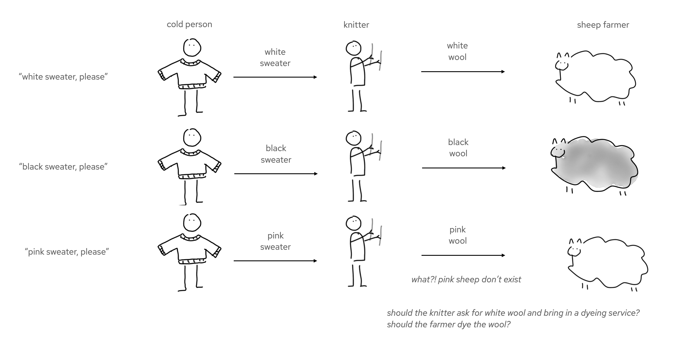

# pact-quarkus-sweater-demo
A sample application for illustrating pact contract testing ideas.

This application has an observability mechanism baked into it. 
The `architecture-recorder` service persists and serves information about the architectural components and runtime interactions. 
The `observer-extension` intercepts interactions, using a Jakarta `Interceptor`, and sends them to the architecture recorder. The observer extension also introduces a delay into each interaction. This would be bad in a real system, but is useful for the visualisation of the system flow.

Note that only the farmer and knitter projects have contract tests. 

See [the demo instructions](./demo-script.md) for a detailed walkthrough.

## More resources

- [Blog about Pact contract testing, and the Quarkus integration](https://quarkus.io/blog/pact-and-quarkus-3/)
- [Presentation (slides and video) about Pact and Quarkus](https://hollycummins.com/contract-testing-devoxx-greece/)
